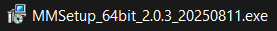
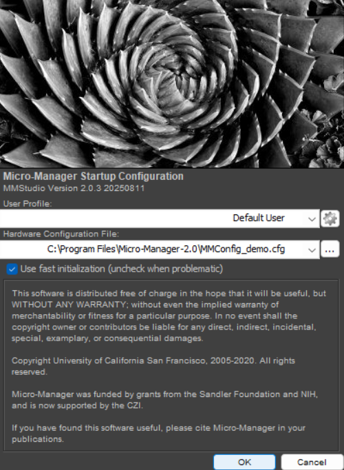
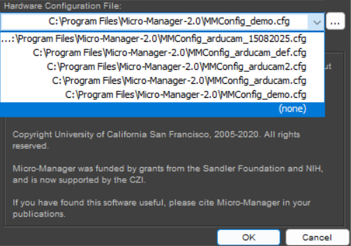

# Tutorial-to-set-up-an-Arducam-USB-2.0-in-Micro-manager-Tutorial
Step by step to set up an Arducam with module USB 2.0 (UVC) in Micro-manager.

## Camera Set up with AMCap
1. Connect the Arducam in the computer.
You have several options to control the camara, in this tutorial AMCap will be used, the idea is to disable automatic options and prevent bugs when Micro-Manager is being used. Also, it is highly recommended to visit Arducam page to understand the camera options, as well as to see the datasheet: https://docs.arducam.com/UVC-Camera/Appilcation-Note/Software-Instruction/UVC-Software-Instructions/. Please, check the SDK of the camera model to comprehense better adjusts in camera.

2. You can download AMCap in this link: https://www.arducam.com/downloads/app/AMCap.exe. Once it is downloaded please open the .exe file.

3. Once the app is opened, select the option 'Devices' and click in 'Arducam USB Camera'.

4. Now, press 'Options' and select 'Video Capture Filter'.

5. In 'Video Proc Amp' uncheck 'White balance', and in 'Camera Control' uncheck exposure and 'Low Light compensation', click 'Apply' and then 'OK'

## Micro-Manager installation
6. It is neccesary to download Version 2.0 from Micro-Manager web, it is strongly recommended to use a Nightly Build version: https://download.micro-manager.org/nightly/2.0/Windows/. Once it is downloaded, open the .exe file and do the installation tutorial. Note: if you have not ImageJ downloaded it can be installed in the tutorial.

## Micro-Manager Configuration
7. Once it is installed restart the PC and open Micro-Manager. It should appear in first instance ImageJ and in a few seconds Micro/Manager starting like this:

8. Only click in Hardware Configuration File to choose '(none)' and select 'OK'.

9. It should appear the following window:

10. Press the option 'Devices' and select 'Harward configuration wizard'.

11. Select 'Create a new configuration' and 'Next'.

12. Now look for 'OpenCVGrabber' in the 'List by module' and click in 'OpenCVGrabber: OpenCVGrabber video input', next press 'add'.

13. Another window will appear, now press below 'Value', choose 'Arducam USB Camera' and then click 'OK'.

14. Now, it will appear in the upper table the category 'OpenCVGrabber:...'. Therefore, press 'Next'.

15. In the following window uncheck 'Use Autoshutter By Default' and press 'Next'.

16. The next window will appear empty, just press 'Next'.

17. This window will also be empty, just press 'Next'.

18. Now, choose where do you want to save the configuration file for later use, fill the file name, press 'Save' and therefore press 'Finish'.

19. Then, configuration was made and the main window will appear, now you can use live or snap to see the camera capturing.

20. If the image seems overexposed, you can try 'Auto Once' in 'Inspect Preview'. This adjust automatically White balance.
  
Now, the image after press 'Auto Once'.
  
  
# NOTE:
Exposure parameters in Micro-Manager must be the same as AMCap, those are -13 to 0, whose respectively ms are in the following table. In other case, it will lead bugs in Micro-Manager. Additionally, the lag in live is proportional to greater exposure times.

Table extracted from: https://docs.arducam.com/UVC-Camera/Appilcation-Note/Software-Instruction/UVC-Software-Instructions/

